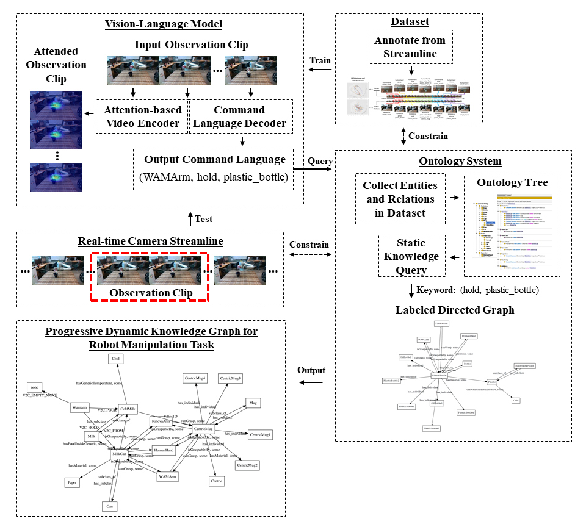

# Robot_Semantics
This is the official implementation decribed in our paper: 

"[Understanding Contexts Inside Joint Robot and Human Manipulation Tasks through Vision-Language Model with Ontology Constraints in a Video Streamline](https://arxiv.org/abs/2003.01163)"

<center>
    <figure> 
        
    </figure>        
</center>

**Update (2020-12-19)**: We have uploaded and updated annotations for a complete release of our RS-RGBD dataset! Access the [wiki page](https://github.com/zonetrooper32/robot_semantics/wiki/Robot-Semantics-Dataset) to check out more. Updated evaluation scores and pre-trained models will be updated in future.


## Requirements
- PyTorch (tested on 1.4)
- TorchVision with PIL
- numpy
- OpenCV (tested with 4.1.0)
- Jupyter Notebook
- coco-caption, a [modified version](https://github.com/flauted/coco-caption/tree/python23) is used to support Python3
- Owlready2
- Graphviz


## Experiments
To repeat the experiments on our Robot Semantics Dataset:
1. Clone the repository. This is the branch for `att-seq2seq`.

2. Download the [Robot Semantics Dataset](https://github.com/zonetrooper32/robot_semantics/wiki/Robot-Semantics-Dataset), check our wiki page for more details. Please extract the dataset and setup the directory path as `datasets/RS-RGBD`.

3. Select a branch to repreat the experiment (Please check our paper for detailed experiment settings). Under the folder `experiment_RS-RGBD/RS-RGBD`, run `generate_clips.py` to sample offline dataset videos into clips for training and evaluation.

4. To begin training, run `train.py`. Modify `v2c/config.py` accordingly to adjust the hyperparameters.

5. For evaluation, firstly run `evaluate.py` to generate predictions given all saved checkpoints. Run `cocoeval.py` to calculate scores for the predictions. `save_att.py` saves all attention maps for visualization demos.

To repeat the experiments on IIT-V2C Dataset, follow up the instructions in my other [repository](https://github.com/zonetrooper32/video2command). 


## Demo
We offer a pretrained model with our attention-seq2seq, download it [here](NEED UPDATES) and put it inside path: `robot_semantics/checkpoints/saved`. 

Two files are provided for demo: (1) A [jupyter notebook](https://github.com/zonetrooper32/robot_semantics/blob/disc-v2c_with_KG-region_att/experiments/demo/kg_demo_fast.ipynb) to visualize the knowledge graph given outputs from the Vision-Language model. (2) `vis_att.py` to visualize all attention maps generated for a single video from the Robot Semantics Dataset. All files are under `robot_semantics/experiments/demo`.


## Additional Note
Please leave me an issue if you find any potential bugs inside the code.

If you find this repository useful, please give me a star and consider citing:
```
@article{jiang2020understanding,
  title={Understanding Contexts Inside Robot and Human Manipulation Tasks through a Vision-Language Model and Ontology System in a Video Stream},
  author={Jiang, Chen and Dehghan, Masood and Jagersand, Martin},
  journal={arXiv preprint arXiv:2003.01163},
  year={2020}
}
```
