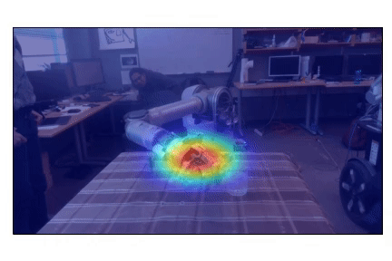
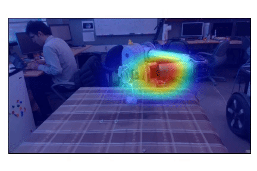
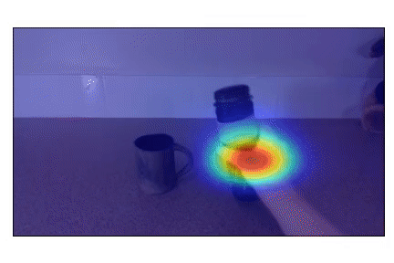
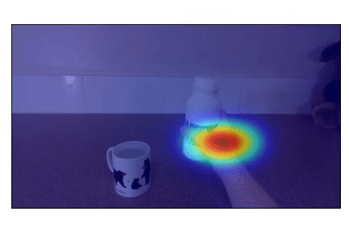

# Robot_Semantics
This is the official implementation of ```attn-seq2seq``` decribed in our paper: 

"[Understanding Contexts Inside Joint Robot and Human Manipulation Tasks through Vision-Language Model with Ontology Constraints in a Video Streamline](https://arxiv.org/abs/2003.01163)"

<center>
    <figure> 
        
    </figure>        
</center>

**Update (2021-1-15)**: Create a [wiki page](https://github.com/zonetrooper32/robot_semantics/wiki/Benchmark-for-Robot-Semantics-Dataset) to keep track of updated model scores after fixes. Please refer to the scores there to compare against our models in the paper.

**Update (2021-1-6)**: A proper pre-trained model is updated.

**Update (2021-1-3)**: Major codebase updates. This repo should work smoothly now.

**Update (2020-12-19)**: We have uploaded and updated annotations for a complete release of our RS-RGBD dataset! Access the [wiki page](https://github.com/zonetrooper32/robot_semantics/wiki/Robot-Semantics-Dataset) to check out more. Updated evaluation scores and pre-trained models will be updated in future.


## Requirements
- PyTorch (tested on 1.4)
- TorchVision with PIL
- numpy
- OpenCV (tested with 4.1.0)
- Jupyter Notebook
- coco-caption, a [modified version](https://github.com/flauted/coco-caption/tree/python23) is used to support Python3
- Owlready2
- Graphviz


## Experiments
To repeat the experiments on our Robot Semantics Dataset:
1. Clone the repository. 

2. Download the [Robot Semantics Dataset](https://github.com/zonetrooper32/robot_semantics/wiki/Robot-Semantics-Dataset), check our wiki page for more details. Please extract the dataset and setup the directory path as`:
```
├── root_dir
|   ├── data
|   |   ├── RS-RGBD
|   |   |   ├── human_grasp_pour
|   |   |   ├── human_point_and_intend
|   |   |   ├── wam_grasp_pour
|   |   |   ├── wam_point_and_intend
|   |   |   ├── eval_human_grasp_pour
|   |   |   ├── eval_wam_grasp_pour
|   |   |   ├── eval_wam_grasp_pour_complex
```

3. To extract features from pre-trained CNNs, under the folder `experiment_RS-RGBD/offline_feat`, run `extract_features.py` to sample offline dataset videos into clips for training and evaluation.

4. Select a branch to repreat the experiment (Please check our paper for detailed experiment settings). Under the folder `experiment_RS-RGBD/offline_feat`, run `generate_clips.py` to sample offline dataset videos into clips for training and evaluation.

5. To begin training, run `train.py`. Modify `rs/config.py` accordingly to adjust the hyperparameters.

6. For evaluation, firstly run `evaluate.py` to generate predictions given all saved checkpoints. Run `cocoeval.py` to calculate scores for the predictions. Best scoring model will be moved to `root_dir/results_RS-RGBD/`.

To repeat the experiments on IIT-V2C Dataset, follow up the instructions in my other [repository](https://github.com/zonetrooper32/video2command). 


## Demo
We offer pretrained models with our attention vision-language model, refer to the [benchmark page](https://github.com/zonetrooper32/robot_semantics/wiki/Benchmark-for-Robot-Semantics-Dataset) and download the one you want. Put the downloaded model inside path: `robot_semantics/checkpoints/`:
```
├── root_dir
|   ├── checkpoint
|   |   ├── vocab.pkl
|   |   ├── saved
|   |   |   ├── v2l_trained.pth
```

A [jupyter notebook](https://github.com/zonetrooper32/robot_semantics/blob/main/experiments/demo/kg_demo_fast.ipynb) to visualize attentions and the knowledge graph given outputs from the Vision-Language model. File is under `robot_semantics/experiments/demo`.

Some demos for visual attentions from our vision-language model:

<p align="center">
  
  
  
  
</p>


## Additional Note
Please leave me an issue if you find any potential bugs inside the code.

If you find this repository useful, please give me a star and consider citing:
```
@article{jiang2020understanding,
  title={Understanding Contexts Inside Robot and Human Manipulation Tasks through a Vision-Language Model and Ontology System in a Video Stream},
  author={Jiang, Chen and Dehghan, Masood and Jagersand, Martin},
  journal={arXiv preprint arXiv:2003.01163},
  year={2020}
}
```
